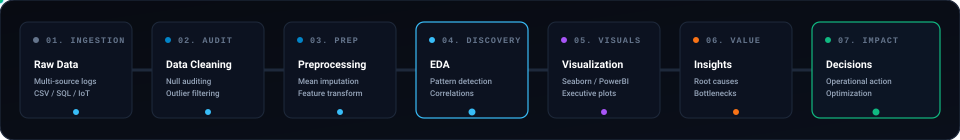

<!-- HERO SECTION: FUTURISTIC DATA SCIENCE HERO -->

 

<!-- ANIMATED TELEMETRY TERMINAL -->

<!-- STATUS BADGES -->

  
  
  
  

---

## 📌 Executive Summary

I am a **Data Scientist & Data Analyst** focused on extracting structured intelligence from messy, ambiguous datasets and translating analytical discoveries into measurable business impact. My approach bridges statistical rigor, clean code architecture, and strategic decision-making:

- **Data Ingestion & Sanitization:** Auditing anomalies, structuring raw logs, and applying statistical imputation methods to preserve data integrity.
- **Exploratory Data Analysis (EDA):** Dissecting high-dimensional feature distributions, trend cycles, outliers, and multivariate correlations.
- **Statistical Modeling & ML:** Designing vectorized transformations, feature engineering pipelines, and baseline machine learning estimators.
- **Insight Synthesis & Dashboards:** Crafting publication-grade visualizations and business intelligence reports that directly answer commercial and operational questions.

---

## 🧠 PRODUCTION-READY DATA SCIENCE ARSENAL

  

<!-- DATA SCIENCE COMMAND CENTER INTERACTIVE VISUAL -->

---

## 🛠️ Technical Stack & Tooling

<table width="100%" border="0" cellpadding="6" cellspacing="0">
  <tr>
    <!-- PROGRAMMING & DATA -->
    <td width="50%" align="center" valign="top">
      
<b>💻 PROGRAMMING &amp; DATA CORE</b>

      
      
        
      
      
    </td>
    <!-- DATA VISUALIZATION -->
    <td width="50%" align="center" valign="top">
      
<b>📊 VISUAL INTELLIGENCE &amp; BI</b>

      
      
        
      
    </td>
  </tr>
  <tr>
    <!-- MACHINE LEARNING -->
    <td width="50%" align="center" valign="top">
       
      
<b>🧠 DATA SCIENCE &amp; ML</b>

      
      
    </td>
    <!-- DEV TOOLS -->
    <td width="50%" align="center" valign="top">
       
      
<b>⚙️ DEV TOOLS &amp; VERSIONING</b>

      
      
        
      
    </td>
  </tr>
</table>

---

## 🚀 Featured Projects

<table>
  <tr>
    <!-- PROJECT 1: SAHL DELIVERY -->
    <td width="50%" valign="top">
      

        <h3>📦 Sahl Delivery — Data Analysis &amp; Insights</h3>
      

      

        Quantitative evaluation of <b>4,295 commercial delivery records</b>. Formulated an end-to-end analytical framework covering data cleaning, missing value handling, temporal feature engineering, and exploratory data analysis to isolate operational bottlenecks, dispatch latency determinants, and customer behavior trends.
      

      

        <b>Technical Scope:</b>
        <ul>
          <li>Audited and transformed 4,295 transactional log entries</li>
          <li>Engineered latency and turnaround duration variables</li>
          <li>Formulated actionable logistics efficiency recommendations</li>
        </ul>
      

      

        
        
        
        
        
      

      

        
      

    </td>
    <!-- PROJECT 2: SENSORS DATA ANALYSIS -->
    <td width="50%" valign="top">
      

        <h3>🌡️ Temperature Sensors Data Analysis</h3>
      

      

        Statistical reliability assessment of real-time thermal telemetry streamed from <b>6 hardware sensors</b>. Designed an automated preprocessing workflow addressing hardware edge failures through statistical mean imputation, variance benchmarking, and temporal trend tracking to validate sensor consistency and identify environmental fluctuations.
      

      

        <b>Technical Scope:</b>
        <ul>
          <li>Handled intermittent sensor dropouts via statistical imputation</li>
          <li>Implemented vectorized NumPy pipelines for rapid aggregations</li>
          <li>Quantified cross-sensor variance and detected calibration drift</li>
        </ul>
      

      

        
        
        
        
      

      

        
      

    </td>
  </tr>
</table>

---

## 🔬 My Data Science Workflow

<!-- ANIMATED WORKFLOW PIPELINE -->

 

| Stage | Focus Area | Analytical Deliverable |
| :--- | :--- | :--- |
| **01. Ingestion** | Multi-source capture | Raw transactional logs, IoT readings, SQL query results |
| **02. Cleaning** | Quality auditing | Missing-value handling, deduplication, schema alignment |
| **03. Preprocessing** | Feature readiness | Mean imputation, categorical encoding, scaling |
| **04. EDA** | Signal discovery | Distribution skewness, correlation matrices, anomaly detection |
| **05. Visualization** | Visual communication | Publication-grade Seaborn plots and interactive Power BI views |
| **06. Insights** | Value extraction | Operational bottleneck diagnostics and root-cause analysis |
| **07. Decisions** | Strategic execution | Concrete recommendations, performance tracking, process gains |

---

## 🎯 Currently Exploring

| Focus Domain | Key Topics &amp; Competencies |
| :--- | :--- |
| **Advanced Programming &amp; Querying** | Advanced Python for Data Science &bull; Advanced SQL Window Functions &bull; CTEs |
| **Mathematical Foundations** | Applied Statistics for Data Science &bull; Hypothesis Testing &bull; Probability Theory |
| **Analytical Rigor** | Multivariate Exploratory Data Analysis &bull; Automated Data Profiling Workflows |
| **Applied Modeling** | Machine Learning Fundamentals &bull; Supervised Regression &amp; Classification |
| **Feature Engineering** | Dimensionality Management &bull; Interaction Variables &bull; Encoding Strategies |
| **Business Intelligence** | Advanced Data Visualization Principles &bull; Dynamic Power BI Modeling |

---

## 📈 GitHub Analytics

  <table border="0" cellpadding="0" cellspacing="4">
    <tr>
      <td align="center" width="50%">
        
      </td>
      <td align="center" width="50%">
        
      </td>
    </tr>
    <tr>
      <td colspan="2" align="center">
        
      </td>
    </tr>
  </table>

---

## 📡 CONNECT WITH ME

<em>Let's connect and turn complex data into meaningful solutions.</em>

<!-- CONNECT ANIMATED PIPELINE -->

 

<!-- THREE SOPHISTICATED CONTACT CARDS -->
<table border="0" cellpadding="8" cellspacing="0" width="100%">
  <tr>
    <!-- EMAIL CARD -->
    <td width="33%" align="center" valign="top">
      

        
<b>📧 EMAIL</b>

        
<small style="color: #94A3B8;">Direct Inquiries &amp; Consultations</small>

        
      

    </td>
    <!-- LINKEDIN CARD -->
    <td width="33%" align="center" valign="top">
      

        
<b>💼 LINKEDIN</b>

        
<small style="color: #94A3B8;">Professional Career Network</small>

        
      

    </td>
    <!-- PORTFOLIO CARD (FEATURED EMPHASIS) -->
    <td width="33%" align="center" valign="top">
      

        
<b>🌐 PORTFOLIO</b>

        
<small style="color: #38BDF8;">Interactive Showcase &amp; Projects</small>

        
      

    </td>
  </tr>
</table>

  

<!-- FOOTER -->

  <b>ETHAR ESSAM</b> &nbsp;|&nbsp; Data Scientist &bull; Data Analyst 
  <small style="color: #64748B;">Synthesizing raw signals into quantifiable business intelligence.</small>

<!-- SUBTLE FOOTER WAVE -->

